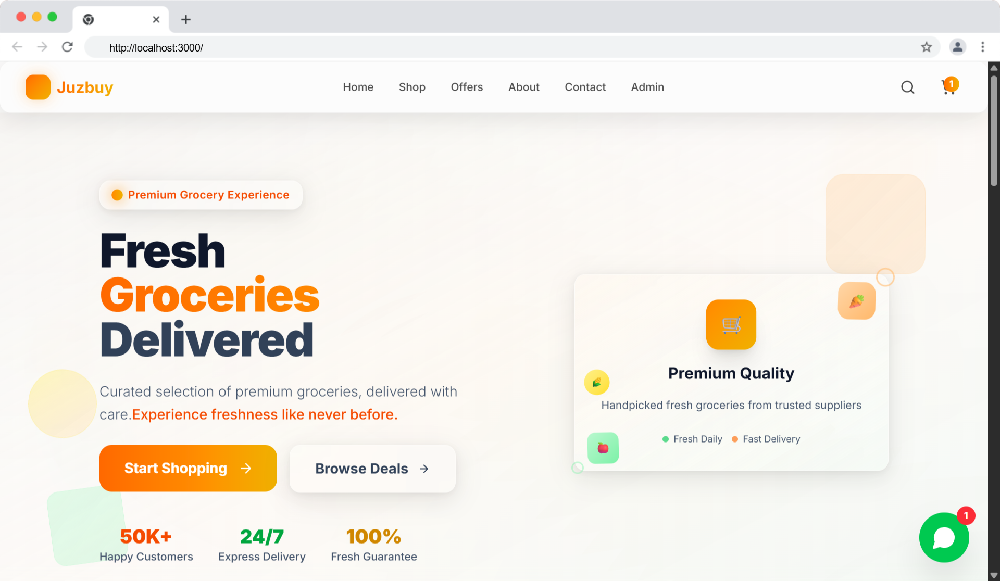

# Juzbuy - Futuristic Grocery Shopping Platform



[](https://nextjs.org/)
[](https://reactjs.org/)
[](https://www.typescriptlang.org/)
[](https://tailwindcss.com/)

A modern, responsive grocery shopping platform built with Next.js 16, React 19, and Tailwind CSS. Features a beautiful UI with futuristic design elements, admin dashboard, and comprehensive e-commerce functionality.

## 🚀 Features

### Customer Features
- **Modern UI/UX**: Futuristic design with smooth animations and glass morphism effects
- **Product Catalog**: Browse products by categories with advanced filtering
- **Shopping Cart**: Add, remove, and manage items with persistent storage
- **Product Search**: Find products quickly with search functionality
- **Responsive Design**: Optimized for desktop, tablet, and mobile devices
- **Dark/Light Mode**: Theme switching support
- **WhatsApp Integration**: Direct customer support through WhatsApp widget

### Admin Features
- **Admin Dashboard**: Comprehensive overview with sales analytics
- **Product Management**: Add, edit, and manage product inventory
- **Order Management**: Track and manage customer orders
- **Stock Management**: Monitor inventory levels and low-stock alerts
- **Billing System**: Generate bills and manage transactions
- **Sales Analytics**: Visual charts and statistics

### Technical Features
- **Server-Side Rendering (SSR)**: Fast page loads and SEO optimization
- **Static Site Generation (SSG)**: Pre-rendered pages for better performance
- **Image Optimization**: Next.js automatic image optimization
- **TypeScript**: Full type safety and better development experience
- **Component Library**: Reusable UI components with shadcn/ui
- **Form Validation**: React Hook Form with Zod validation
- **State Management**: React Context for cart and app state
- **Responsive Images**: Optimized images for different screen sizes

## 🛠️ Tech Stack

- **Framework**: Next.js 16 (App Router)
- **Frontend**: React 19, TypeScript
- **Styling**: Tailwind CSS 4, shadcn/ui components
- **Icons**: Lucide React
- **Animations**: Framer Motion
- **Forms**: React Hook Form + Zod validation
- **Charts**: Recharts
- **Date Handling**: date-fns
- **Image Handling**: Next.js Image optimization

## 📦 Installation

### Prerequisites
- Node.js 18.0 or later
- npm, yarn, or pnpm

### Local Development

1. **Clone the repository**
   ```bash
   git clone https://github.com/your-username/juzbuy.git
   cd juzbuy
   ```

2. **Install dependencies**
   ```bash
   npm install
   # or
   yarn install
   # or
   pnpm install
   ```

3. **Set up environment variables**
   ```bash
   cp .env.example .env.local
   ```
   Edit `.env.local` with your configuration values.

4. **Run the development server**
   ```bash
   npm run dev
   # or
   yarn dev
   # or
   pnpm dev
   ```

5. **Open your browser**
   Navigate to [http://localhost:3000](http://localhost:3000)

## 🐳 Docker Deployment

### Using Docker Compose (Recommended)

1. **Clone and configure**
   ```bash
   git clone https://github.com/your-username/juzbuy.git
   cd juzbuy
   cp .env.example .env
   ```

2. **Build and run**
   ```bash
   docker-compose up -d
   ```

3. **Access the application**
   - Application: http://localhost:3000
   - With Nginx: http://localhost

### Using Docker directly

```bash
# Build the image
docker build -t juzbuy .

# Run the container
docker run -p 3000:3000 juzbuy
```

## 🚀 Production Deployment

### Vercel (Recommended)

1. **Deploy to Vercel**
   ```bash
   npm install -g vercel
   vercel
   ```

2. **Configure environment variables** in Vercel dashboard

3. **Set up custom domain** (optional)

### Manual Server Deployment

1. **Build the application**
   ```bash
   npm run build
   npm run start:prod
   ```

2. **Use PM2 for process management**
   ```bash
   npm install -g pm2
   pm2 start ecosystem.config.js
   ```

3. **Set up Nginx reverse proxy** (see `nginx.conf`)

## ⚙️ Configuration

### Environment Variables

Create a `.env.local` file based on `.env.example`:

```env
# Application
NEXT_PUBLIC_APP_NAME=Juzbuy
NEXT_PUBLIC_APP_URL=https://your-domain.com

# WhatsApp Business
NEXT_PUBLIC_WHATSAPP_PHONE=+919876543210
NEXT_PUBLIC_BUSINESS_NAME=Fresh Groceries Store

# Analytics (optional)
NEXT_PUBLIC_GA_TRACKING_ID=G-XXXXXXXXXX
```

### Next.js Configuration

The `next.config.mjs` file includes:
- Image optimization settings
- Security headers
- TypeScript and ESLint configuration
- Performance optimizations

## 📱 Usage

### Customer Journey

1. **Browse Products**: Navigate through categories or use search
2. **Add to Cart**: Click "Add to Cart" on desired products
3. **Review Cart**: Check items and quantities in the cart sidebar
4. **Checkout**: Proceed to checkout (currently simulated)
5. **Contact Support**: Use WhatsApp widget for assistance

### Admin Access

1. **Navigate to Admin**: Visit `/admin` route
2. **Dashboard**: View sales analytics and quick stats
3. **Manage Products**: Add/edit products in `/admin/stock`
4. **View Orders**: Monitor orders in `/admin/orders`
5. **Billing**: Generate bills in `/admin/billing`

## 🔧 Development

### Available Scripts

```bash
# Development
npm run dev          # Start development server
npm run build        # Build for production
npm run start        # Start production server
npm run start:prod   # Start with production environment

# Code Quality
npm run lint         # Run ESLint
npm run lint:fix     # Fix ESLint issues
npm run type-check   # TypeScript type checking

# Utilities
npm run clean        # Clean build files
npm run analyze      # Analyze bundle size
```

### Project Structure

```
juzbuy/
├── app/                    # Next.js App Router pages
│   ├── admin/             # Admin dashboard pages
│   ├── globals.css        # Global styles
│   ├── layout.tsx         # Root layout
│   └── page.tsx           # Home page
├── components/            # React components
│   ├── admin/             # Admin-specific components
│   ├── ui/                # shadcn/ui components
│   └── ...                # Feature components
├── context/               # React Context providers
├── data/                  # Static data and types
├── hooks/                 # Custom React hooks
├── lib/                   # Utility functions
├── public/                # Static assets
├── styles/                # Additional styles
├── .env.example           # Environment variables template
├── Dockerfile             # Docker configuration
├── docker-compose.yml     # Docker Compose setup
├── nginx.conf             # Nginx configuration
└── package.json           # Dependencies and scripts
```

## 🔐 Security

- **Security Headers**: X-Frame-Options, X-Content-Type-Options, etc.
- **HTTPS Ready**: SSL/TLS configuration in Nginx
- **Rate Limiting**: API endpoint protection
- **Input Validation**: Zod schema validation
- **XSS Protection**: Next.js built-in protections

## 🎨 Customization

### Theme Customization

1. **Colors**: Modify CSS variables in `globals.css`
2. **Components**: Update shadcn/ui components in `components/ui/`
3. **Layout**: Customize layouts in `app/layout.tsx`

### Adding New Features

1. **New Pages**: Create in `app/` directory
2. **Components**: Add to `components/` directory
3. **APIs**: Create in `app/api/` directory (future enhancement)

## 🧪 Testing

```bash
# Run tests (to be implemented)
npm run test

# Run tests in watch mode
npm run test:watch

# Generate coverage report
npm run test:coverage
```

## 📈 Performance

- **Lighthouse Score**: Optimized for 90+ scores
- **Image Optimization**: WebP/AVIF formats
- **Code Splitting**: Automatic with Next.js
- **Caching**: Browser and CDN caching strategies
- **Bundle Analysis**: Use `npm run analyze`

## 🔄 Future Enhancements

- [ ] User authentication and accounts
- [ ] Payment gateway integration (Stripe/Razorpay)
- [ ] Real-time inventory management
- [ ] Email notifications
- [ ] Mobile app (React Native)
- [ ] Advanced analytics dashboard
- [ ] Multi-language support
- [ ] Product reviews and ratings
- [ ] Wishlist functionality
- [ ] Order tracking system

## 🤝 Contributing

1. Fork the repository
2. Create a feature branch (`git checkout -b feature/amazing-feature`)
3. Commit your changes (`git commit -m 'Add amazing feature'`)
4. Push to the branch (`git push origin feature/amazing-feature`)
5. Open a Pull Request

### Development Guidelines

- Follow TypeScript best practices
- Use ESLint and Prettier for code formatting
- Write meaningful commit messages
- Add comments for complex logic
- Update documentation for new features

## 📝 License

This project is licensed under the MIT License - see the [LICENSE](LICENSE) file for details.

## 📞 Support

- **Documentation**: Check this README and code comments
- **Issues**: Create an issue on GitHub
- **Contact**: [your-email@example.com]
- **WhatsApp**: +919876543210 (for demo purposes)

## 🙏 Acknowledgments

- [Next.js](https://nextjs.org/) for the amazing React framework
- [shadcn/ui](https://ui.shadcn.com/) for the beautiful UI components
- [Tailwind CSS](https://tailwindcss.com/) for utility-first CSS
- [Lucide](https://lucide.dev/) for the icon library
- [Unsplash](https://unsplash.com/) for product images

---

**Made with ❤️ for the future of grocery shopping**